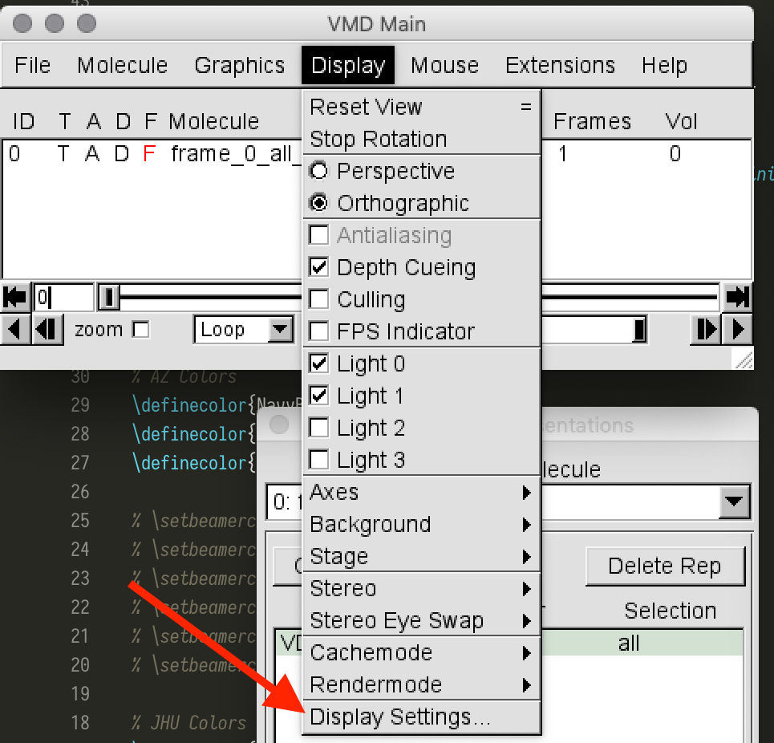
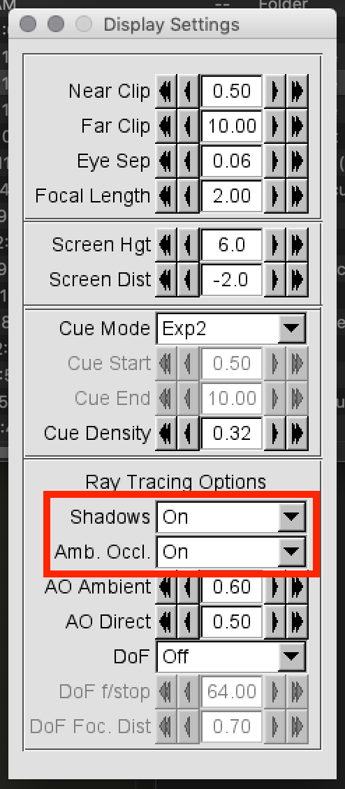
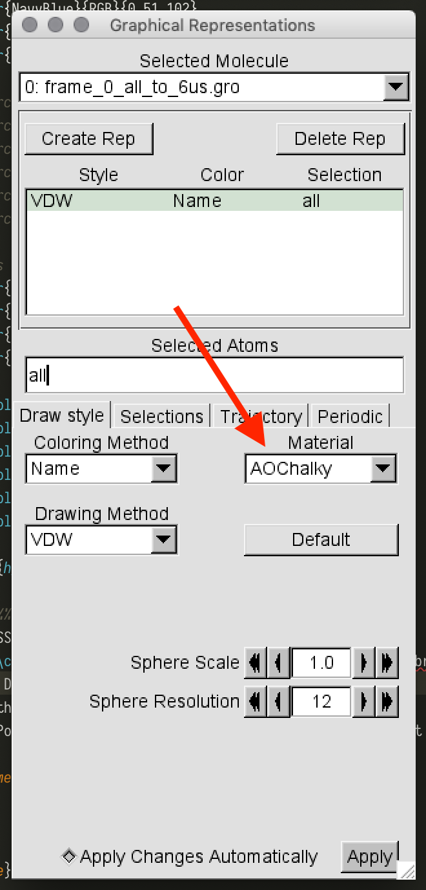
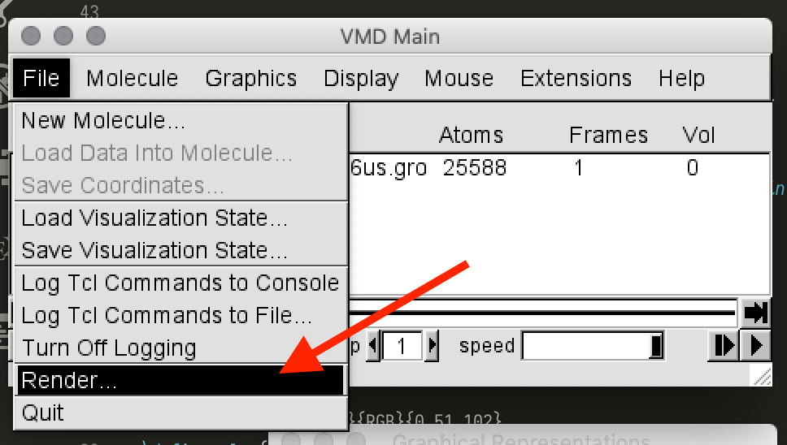
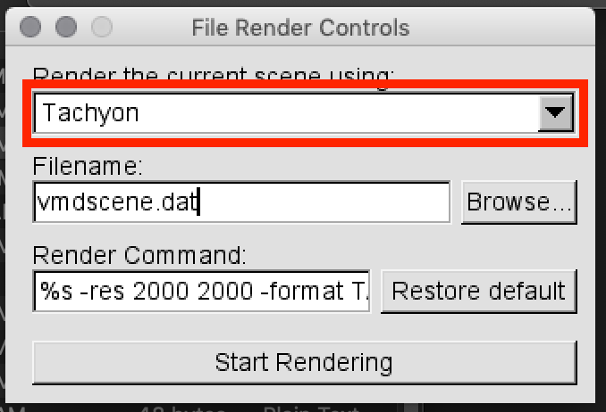

# Render nice images with VMD

1. Make sure ambient occlusion and shadows are set to on under Display -> Display Settings

2. Set the Material under Display -> Graphical Representations to `AOChalky`, `AOEdgy`, or `AOShiny`. `AOChalky` looks best, with `AOEdgy` good for when you want something specific to pop out. This looks best with the CPK or VDW representations.

3. Render the image with Tachyon. Add `-res $WIDTH $HEIGHT` to the render at specific resolutions (e.g. `-res 2000 2000`).

4. To get the image in a more versatile format, run `convert $FILE.tga $FILE.png` from the command-line. Add the `-trim` command to trim buffering whitespace.
